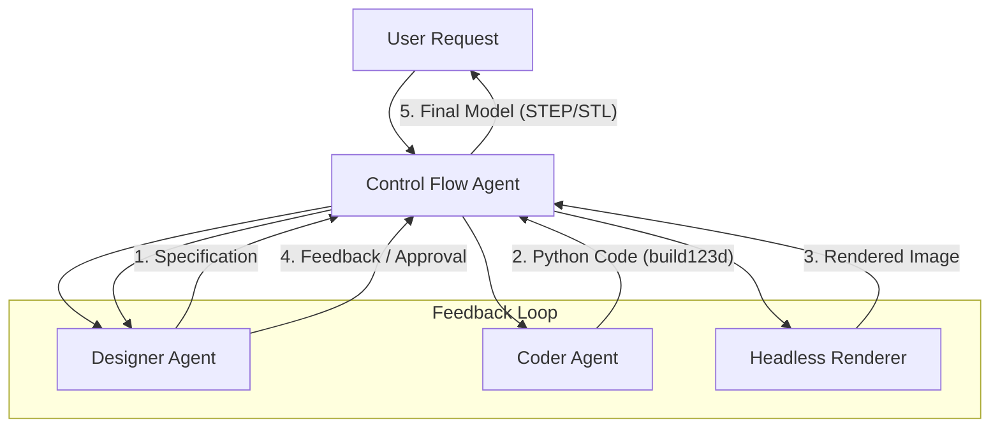

# Forma AI


Forma AI is an advanced agentic service designed to generate parametric 3D CAD models from natural language descriptions. It leverages a multi-agent architecture to design, code, render, and iteratively refine 3D models using the `build123d` Python library.

## How It Works

Forma AI operates as a coordinated system of specialized AI agents, orchestrated to mimic a real-world engineering workflow.

### Architecture

The system is built on a **Control Flow** architecture that manages the lifecycle of a task from initial prompt to final approved model.



### Components

1.  **Control Flow Agent**: The central orchestrator. It manages the session, maintains state, and executes the feedback loop. It ensures that the output from one agent (e.g., the spec) is correctly passed to the next (e.g., the coder).

2.  **Designer Agent**: Acts as the product designer.
    *   **Role**: Analyzes user requests and creates detailed technical specifications.
    *   **Capabilities**: Uses **RAG (Retrieval-Augmented Generation)** to access the latest `build123d` documentation and **Google Search** to find reference images or concepts.
    *   **Feedback**: Reviews rendered images of the generated model against the original specification and provides constructive feedback to the Coder Agent.

3.  **Coder Agent**: The software engineer.
    *   **Role**: Translates technical specifications into executable Python code using the `build123d` library.
    *   **Capabilities**: Specialized in CAD geometry logic and Python scripting.

4.  **Headless Renderer**: The visualization engine.
    *   **Role**: Takes the generated STL/STEP files and produces high-quality 2D images.
    *   **Tech**: Uses `PyVista` with EGL/OSMesa for server-side, headless rendering (no GPU/Display required).

5.  **RAG System**: A vector database (ChromaDB) containing the full documentation of the `build123d` library. This ensures the agents use valid, up-to-date syntax and features.

## Features

*   **Text-to-CAD**: Convert simple text prompts into complex 3D geometry.
*   **Iterative Self-Correction**: The system automatically detects errors (syntax or visual) and retries until the model matches the specification.
*   **Visual Feedback**: The Designer agent "sees" the model via rendered images, allowing for visual validation.
*   **Parametric Code**: The output is not just a mesh, but Python code that can be modified and parameterized.
*   **Standard Formats**: Exports to STEP (for CAD software) and STL (for 3D printing).

## Getting Started

### Prerequisites

*   Docker
*   Docker Compose
*   Google Cloud API Key (for Gemini models)

### Installation

To run the service standalone using Docker:

1.  **Build the image:**
    ```bash
    docker build -t forma-ai-service .
    ```

2.  **Run the container:**
    You need to provide your Google API Key.
    ```bash
    docker run -p 8001:8001 \
      -e GOOGLE_API_KEY=your_key_here \
      -e GEMINI_API_KEY=your_key_here \
      forma-ai-service
    ```


### API Usage

The service implements an asynchronous "Agent-to-Agent" (A2A) protocol. It follows the specification at [https://a2a-protocol.org/latest/specification/](https://a2a-protocol.org/latest/specification/), using JSON as the data format.

We provide a ready-to-use Python client in the `example/` directory.

**Running the Example:**

1.  Ensure the service is running (see Installation).
2.  Install `requests`:
    ```bash
    pip install requests
    ```
3.  Run the client script:
    ```bash
    python example/client.py "Design a 10x10x10 cm cube with a 5mm hole in the center."
    ```

The script will submit the prompt, poll for completion, and print the download URLs for the generated files.

