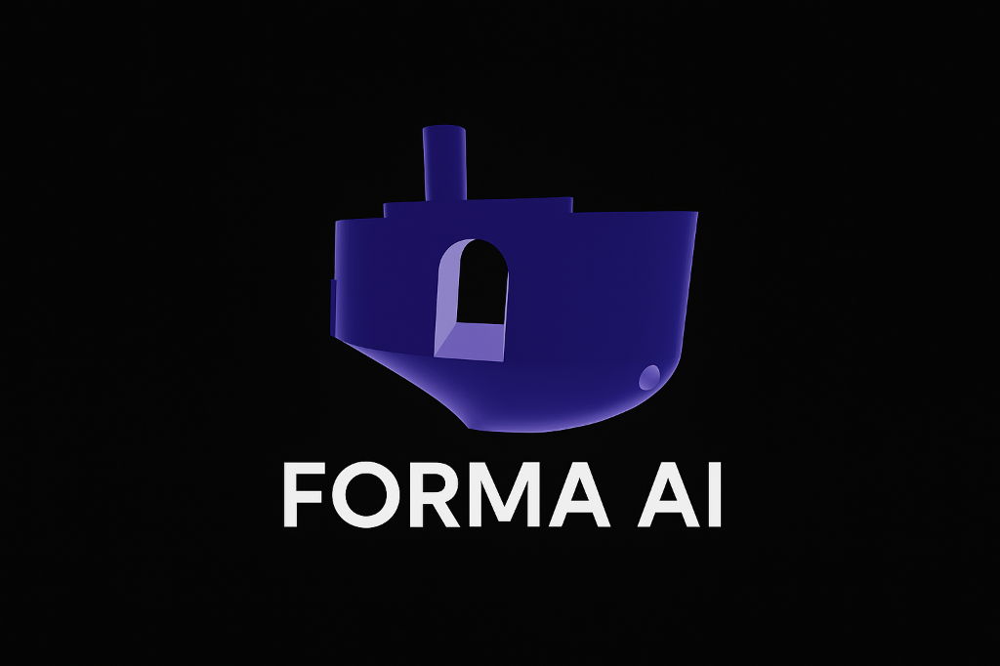
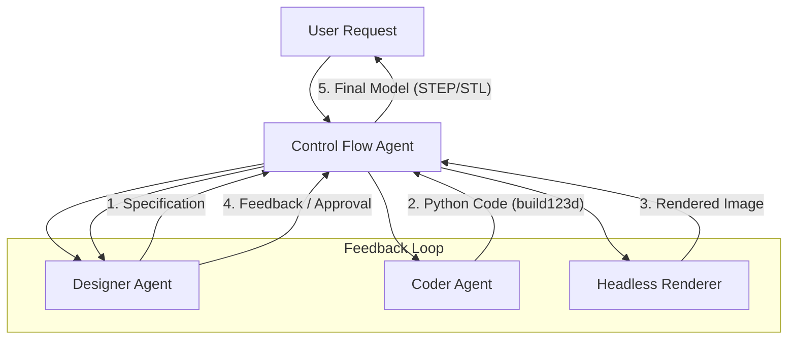
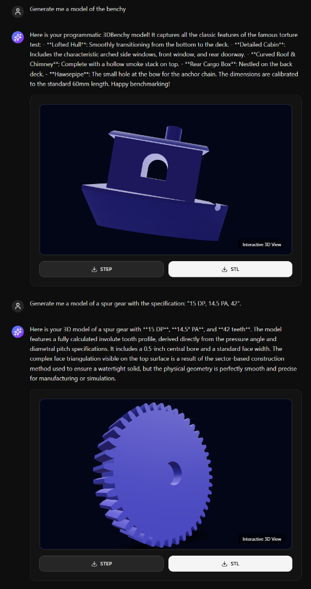

# Forma AI Agent Service



[](https://opensource.org/licenses/Apache-2.0)

Forma AI is an AI agent which generates parametric 3D CAD models (STEP/STL) from natural language descriptions. It is aiming to produce precise, engineering-grade geometry suitable for manufacturing and 3D printing. 

### Architecture

Forma AI is a multi-agent AI system (service). It implements built  a **Control Flow** architecture that manages the lifecycle of a task from initial prompt to final approved model.



### Components

1.  **Control Flow Agent**: The central orchestrator. It manages the session, maintains state, and executes the feedback loop. It ensures that the output from one agent (e.g., the spec) is correctly passed to the next (e.g., the coder).

2.  **Designer Agent**: Acts as the product designer.
    *   **Role**: Analyzes user requests and creates detailed technical specifications.
    *   **Capabilities**: Uses **RAG (Retrieval-Augmented Generation)** to access the latest `build123d` documentation and **Google Search** to find reference images or concepts.
    *   **Feedback**: Reviews rendered images of the generated model against the original specification and provides constructive feedback to the Coder Agent.

3.  **Coder Agent**: The software engineer.
    *   **Role**: Translates technical specifications into executable Python code using the `build123d` library.
    *   **Capabilities**: Specialized in CAD geometry logic and Python scripting.

4.  **Headless Renderer**: The visualization engine.
    *   **Role**: Takes the generated STL/STEP files and produces high-quality 2D images.
    *   **Tech**: Uses `PyVista` with EGL/OSMesa for server-side, headless rendering (no GPU/Display required).

5.  **RAG System**: A vector database (ChromaDB) containing the full documentation of the `build123d` library. This ensures the agents use valid, up-to-date syntax and features.

## Features

*   **Text-to-CAD**: Convert simple text prompts into complex 3D geometry.
*   **Iterative Self-Correction**: The system automatically detects errors (syntax or visual) and retries until the model matches the specification.
*   **Visual Feedback**: The Designer agent "sees" the model via rendered images, allowing for visual validation.
*   **Parametric Code**: The output is not just a mesh, but Python code that can be modified and parameterized.
*   **Standard Formats**: Exports to STEP (for CAD software) and STL (for 3D printing).

## Limitations

*   **Stateless Execution**: Each task is fully independent. The agent does not retain context from previous requests. You cannot ask the agent to "modify the previous model" or "make the hole bigger"; you must provide the full specification for the modified model in a new request.

*   **Speed**: The execution of the model generation loop involves multiple agents and potentially multiple retries, which depends on the request complexity, references in documentation (i.e. rag results), search results and so on. This process takes quite some time. 

*  **AI Perfomance**: AI by design generates probabilistic results and they can vary in terms of quality. Current implementation uses Gemini 3.0 pro that is a very powerful model, but yet is not specialized in CAD geometry generation. LiteLLM allows to switch between different models, maybe in the futre the model will be replaced with a more specialized one.

*   **Security**: The system is designed to execute code writtend by the model. The current implementation is not meant to be a production ready service with external users. It is more like a proof of concept for personal use. Authentication, tenancy-isolation and propper code execution isolation are not implemented.   

## Getting Started

### Prerequisites

*   Docker
*   Google Cloud API Key (for Gemini models and Google Custom Search)

### Installation

The recommended way to run the service is using Docker Compose. This will start both the backend service and the frontend UI.

1.  **Clone the repository:**
    ```bash
    git clone https://github.com/andreyka/forma-ai-service.git
    cd forma-ai-service
    ```

2.  **Configure Environment Variables:**
    Copy the example environment file and add your API keys.
    ```bash
    cp .env.example .env
    ```
    Edit `.env` and set your `GOOGLE_API_KEY`.

3.  **Start the Application:**
    ```bash
    docker compose up --build
    ```

### User Interface

The application includes a web-based user interface for interacting with the agent.

*   **URL**: `http://localhost:3000`
*   **Source**: The frontend code is fetched automatically from [https://github.com/andreyka/forma-ai-frontend](https://github.com/andreyka/forma-ai-frontend).

The UI allows you to enter natural language prompts, view the conversation history, and download the generated 3D models.




### API Usage

The service implements an asynchronous "Agent-to-Agent" (A2A) protocol. It follows the specification at [https://a2a-protocol.org/latest/specification/](https://a2a-protocol.org/latest/specification/), using JSON as the data format.

A reference client implementation is provided in the `example/` directory.

**Running the Example:**

1.  Ensure the service is running (see Installation).
2.  Install `requests`:
    ```bash
    pip install requests
    ```
3.  Run the client script:
    ```bash
    python example/client.py "Design a 10x10x10 cm cube with a 5mm hole in the center."
    ```

The script will submit the prompt, poll for completion, and print the download URLs for the generated files.

## Licenses

This project uses the following open-source libraries:

*   **build123d**: [Apache License 2.0](licenses/BUILD123D_LICENSE)
*   **PyVista**: [MIT License](licenses/PYVISTA_LICENSE)
*   **Google Generative AI**: [Apache License 2.0](licenses/GOOGLE_GENAI_LICENSE)
*   **Playwright**: [Apache License 2.0](licenses/PLAYWRIGHT_LICENSE)
*   **ChromaDB**: [Apache License 2.0](licenses/CHROMADB_LICENSE)
